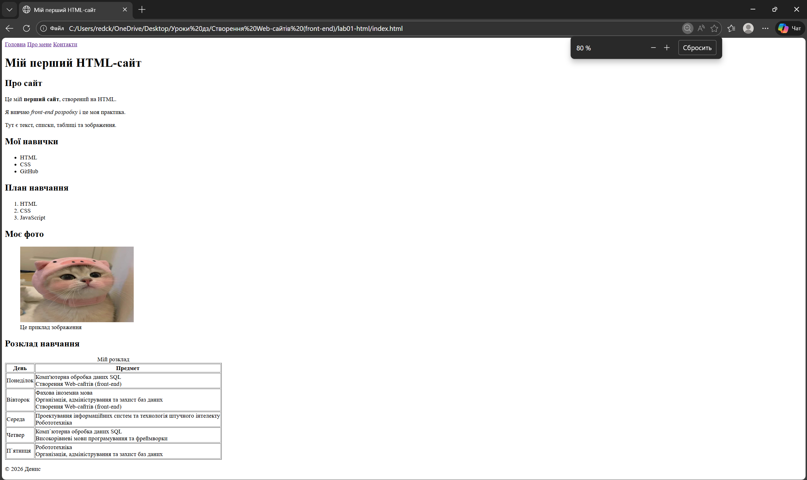
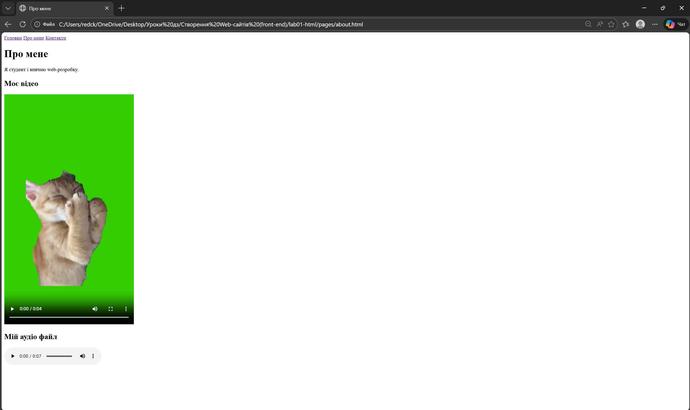
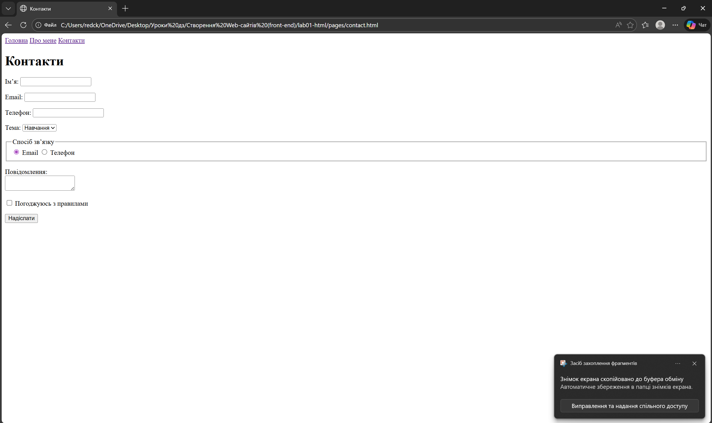

# Практична робота №3

## Що зроблено:
- Створено 3 HTML сторінки
- Додано навігацію
- Реалізовано форму
- Додано відео та аудіо
- Використано таблиці, списки, зображення

## Як запустити:
Відкрити файл index.html у браузері

## Скріншоти

